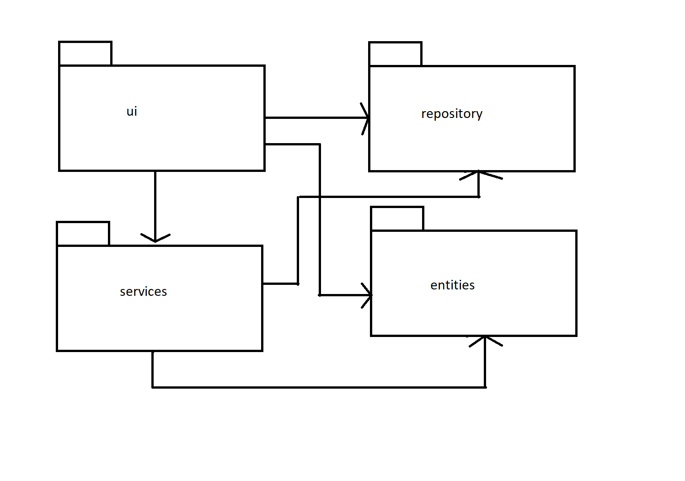
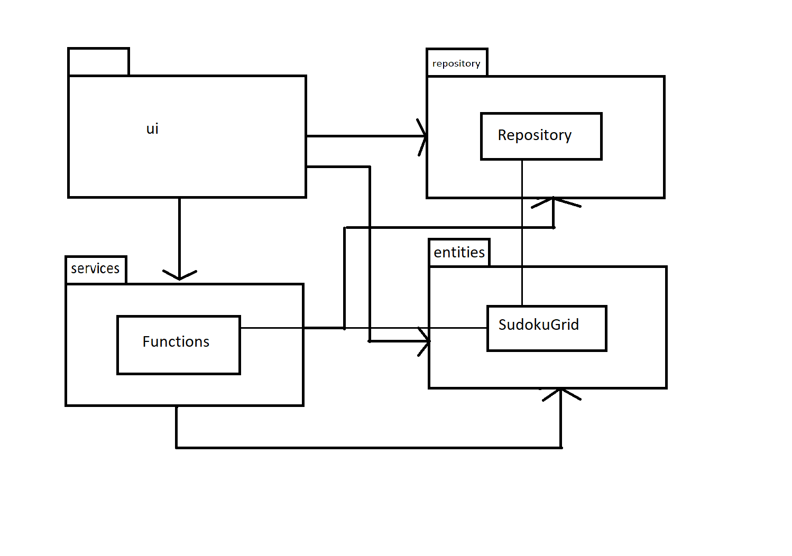
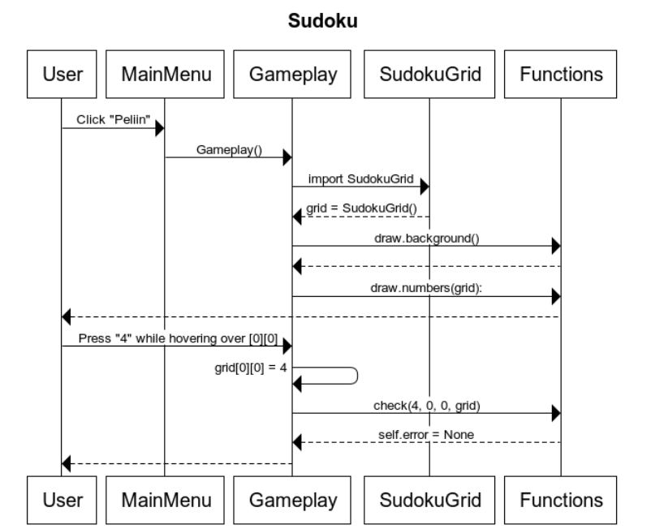

# Arkkitehtuuri

## Rakenne

Koodin pakkausrakenne on seuraava:


Pakkaus _ui_ sisältää käyttöliittymästä, _services_ sovelluslogiikasta ja _repositories_ 
tietojen pysyväistallennuksesta vastaavan koodin. Pakkaus _entities_ sisältää Sudoku-ruudukkojen
dataa vastaavan koodin.

## Käyttöliittymä

Käyttöliittymä sisältää kolme erillistä näkymää:

- Main Menu
- Tulostaulu
- Pelisessio

Jokainen näistä on toteutettu omana luokkanaan. Näkymistä yksi on aina kerrallaan näkyvänä. 
Näkymien näyttämisestä vastaa luokat _MainMenu_, _Results_ ja _Gameplay_. 
Käyttöliittymä on suurimmilta osin eriytetty sovelluslogiikasta. 

## Sovelluslogiikka

Sovelluslogiikan muodostavat suurimmilta osin luokat _Functions_, _SudokuGrid_, _Repository_.

_Functions_ suorittaa ruudukon piirtämisen saaden piirrettävän ruudukon luokalta _SudokuGrid_, 
pelaajan syötteiden tarkistamisen, numeroiden piirtämisen, tekstien piirtämisen, tulosten esittämisen 
ja tulosten lähettämisen luokalle _Repository_, joka puolestaan tallentaa csv-tiedostoon pelaajan tuloksen.

Luokka/pakkauskaavio:


## Tietojen pysyväistallennus

Pakkauksen _repositories_ luokka Repository huolehtii tietojen tallennuksesta csv-tiedostoihin.

### Tiedostot

Helpon sudokun tulokset tallennetaan tiedostoon _easy_results.csv_, normaalin tiedostoon _normal_results.csv_,
ja vaikean tiedostoon _hard_results.csv_.

Tiedot talletetaan seuraavassa formaatissa:

```
atte;00:06:12:31
```

Eli valittu nimimerkki ja suoritusaika muodossa hh:mm:ss:cc.

## Päätoiminnallisuudet

### Sudokun pelaaminen

Sekvenssikaavio kuvaa pelaajan siirtymää menusta peliin, ja numeron 4 asettamista ruutuun [0][0]


## Ohjelman rakenteeseen jääneet heikkoudet

### Sovelluslogiikka

Luokan _Functions_ funktio _check_squares_ sisältää paljon toisteisuutta, josta voisi esim. 
toiminnallisuutta uusiin pienempiin funktiohin jakamalla päästä eroon.