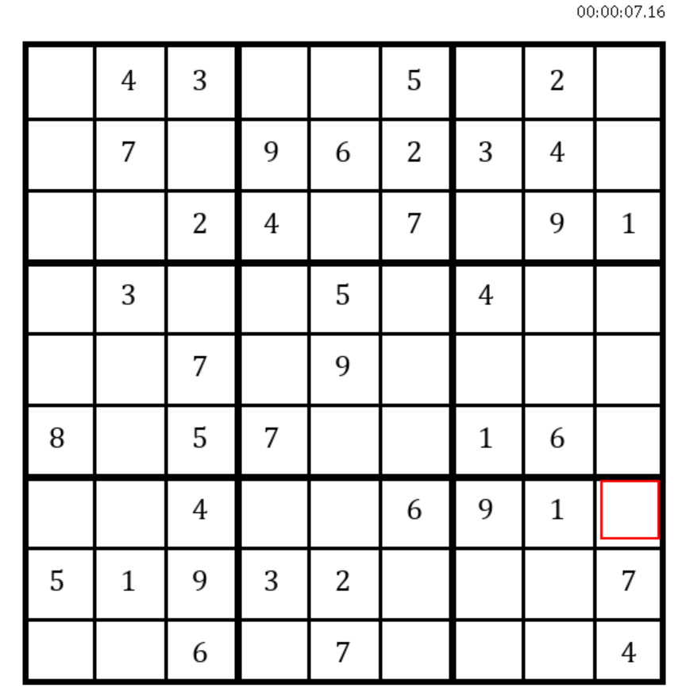
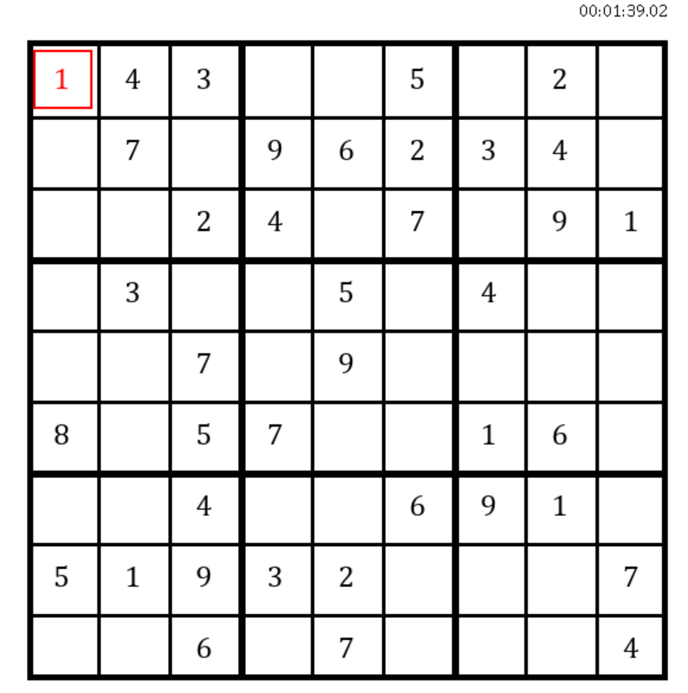
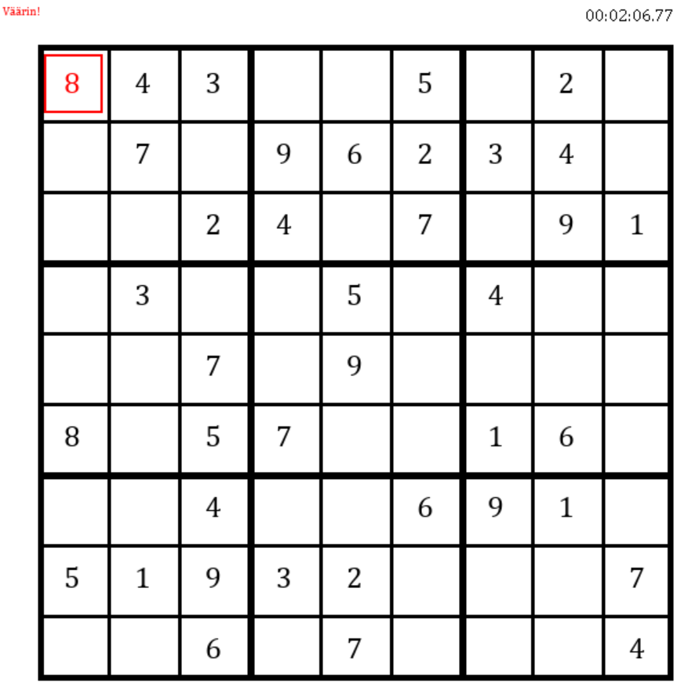
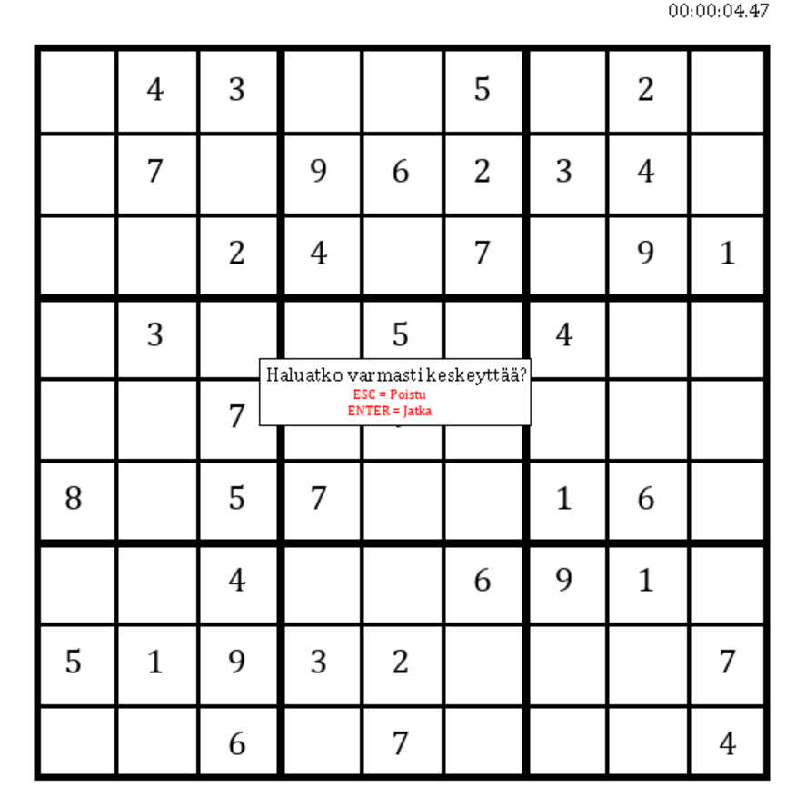
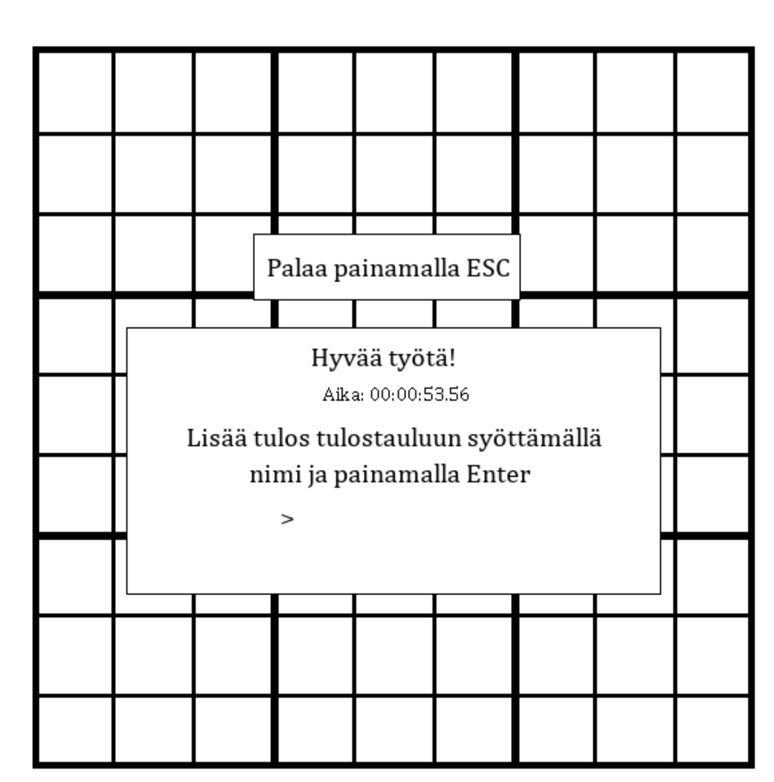

# Käyttöohje

## Sudokun täyttäminen

Halutun ruudun saa valikoitua liikuttamalla kursorin ruudun päälle. 

Painamalla numeronäppäintä väliltä 1-9 saa asetettua numeron valittuun ruutuun.
Ruudun ollessa valittuna painamalla 0 ruutu tyhjenee, mikäli siihen on asetettu numero.

Mikäli valinta on ilmeisen virheellinen, eli asetettu numero on ristiriidassa pysty- tai
vaakarivin tai 3x3-ruudukon kanssa, peli ilmoittaa siitä vas. yläkulmassa. 
Täyttäminen ei voi jatkua, ennen kuin virhe on korjattu tyhjentämällä ruutu painamalla 0.

## Pelin keskeyttäminen

Painamalla ESC peli varmistaa, haluaako pelaaja keskeyttää sudokun, ja tarjoaa jatko-ohjeet.

## Sudokun ratkaiseminen ja tuloksen tallentaminen

Sudokun ratkaistua ilmestyy voittoruutu, johon voi syöttää nimimerkkinsä (1-10 kirjainta, 
käytössä lower- ja uppercase a-z) ja painamalla Enter tallentaa tuloksensa tulostauluun,
jonka voi nähdä Main Menun kautta. Escistä palataan vaikeustasovalikkoon.

