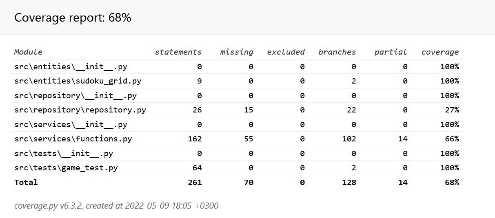

# Testausdokumentti

Ohjelmaa on testattu yksikkö- ja integraatiotestein UnitTestillä.

### Yksikkö ja -integraatiotestaus

#### Sovelluslogiikka

Luokka _TestGame_ testaa pääosin luokkaa _Functions_.

#### Testauskattavuus

Sovelluslogiikan testauksen haaraumakattavuus on 68%.

